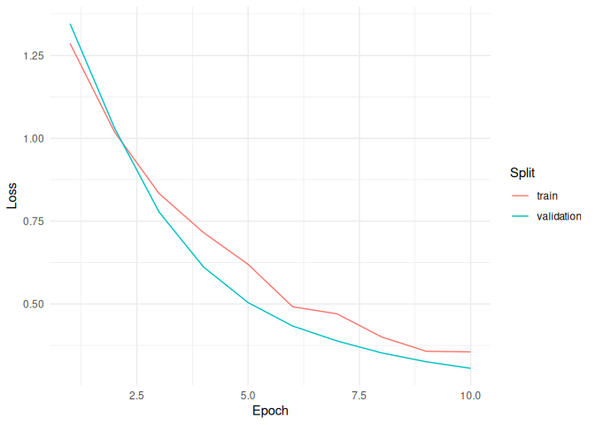
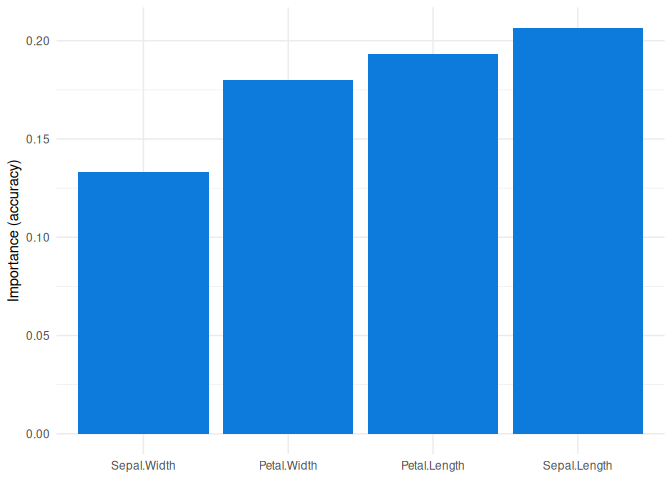

# densemlp

`densemlp` provides dense multilayer perceptron models for tabular
regression and classification in R. The package is built around fully
connected feed-forward neural network layers and supports optional
modern extensions such as dropout, batch normalization, residual
connections, gated blocks, and input projection.

The models implemented in `densemlp` are dense feed-forward multilayer
perceptrons. Optional components such as dropout, batch normalization,
residual connections, gated blocks, and input projection extend the
basic dense multilayer perceptron architecture but do not change the
model class into a convolutional, recurrent, transformer, or tree-based
model.

`task` is optional in the main API. When it is set to `"auto"` or
omitted, the task is inferred from the outcome. Use it only when you
need to override that inference.

## Why `densemlp`?

The name `densemlp` reflects the core architecture used by the package:
multilayer perceptrons built from dense, fully connected neural network
layers. Additional options such as dropout, batch normalization,
residual connections, gated blocks, and input projection are implemented
around these dense blocks.

Source repository: <https://github.com/ielbadisy/densemlp>

Install it from GitHub with:

``` r
remotes::install_github("ielbadisy/densemlp")
```

For local development without reinstalling after each edit:

``` r
pkgload::load_all(".")
```

Do not source individual files such as `R/densemlp.R`; the exported
functions depend on helpers that are loaded through the package
namespace.

## Features

- Binary classification, multiclass classification, and regression.
- Formula-based interface.
- Automatic preprocessing for missing numeric values, missing
  categorical values, and unseen prediction-time categories.
- Configurable hidden layers, activation, dropout, batch normalization,
  residual blocks, gated blocks, and input projection.
- Early stopping, learning-rate schedules, and common `torch`
  optimizers.
- Task-aware predictions, metrics, training-history plots, tuning, and
  permutation importance.

## Classification Example

``` r
library(densemlp)

fit <- densemlp(
  Species ~ .,
  data = iris,
  epochs = 10,
  validation = 0.2,
  verbose = TRUE,
  seed = 1
)
```

    ## Training dense multilayer perceptron
    ## Task: multiclass classification
    ## Optimizer: Adam
    ## Learning rate: 0.001
    ## Epochs: 10
    ## Batch size: 32
    ## Epoch 01/10 | train_loss: 1.2860 | valid_loss: 1.3458 | valid_acc: 0.0333
    ## Epoch 02/10 | train_loss: 1.0189 | valid_loss: 1.0308 | valid_acc: 0.4667
    ## Epoch 03/10 | train_loss: 0.8334 | valid_loss: 0.7775 | valid_acc: 0.7333
    ## Epoch 04/10 | train_loss: 0.7153 | valid_loss: 0.6115 | valid_acc: 0.9000
    ## Epoch 05/10 | train_loss: 0.6196 | valid_loss: 0.5043 | valid_acc: 0.9000
    ## Epoch 06/10 | train_loss: 0.4918 | valid_loss: 0.4336 | valid_acc: 0.9000
    ## Epoch 07/10 | train_loss: 0.4702 | valid_loss: 0.3883 | valid_acc: 0.8667
    ## Epoch 08/10 | train_loss: 0.4005 | valid_loss: 0.3524 | valid_acc: 0.9000
    ## Epoch 09/10 | train_loss: 0.3574 | valid_loss: 0.3257 | valid_acc: 0.9000
    ## Epoch 10/10 | train_loss: 0.3554 | valid_loss: 0.3058 | valid_acc: 0.9000

``` r
predict(fit, iris[1:5, ], type = "class")
```

    ## [1] setosa setosa setosa setosa setosa
    ## Levels: setosa versicolor virginica

``` r
predict(fit, iris[1:5, ], type = "prob")
```

    ##         setosa  versicolor   virginica
    ## [1,] 0.9823542 0.009474045 0.008171768
    ## [2,] 0.9266943 0.051082314 0.022223408
    ## [3,] 0.9656487 0.022011787 0.012339532
    ## [4,] 0.9343854 0.044696244 0.020918327
    ## [5,] 0.9836846 0.009770629 0.006544733

``` r
pred <- predict(fit, iris, type = "class")
densemlp_metrics(iris$Species, pred)
```

    ## $accuracy
    ## [1] 0.9466667

## Regression Example

``` r
fit_reg <- densemlp(
  mpg ~ disp + hp + wt,
  data = mtcars,
  epochs = 10,
  validation = 0.2,
  verbose = FALSE,
  seed = 2
)

pred_reg <- predict(fit_reg, mtcars, type = "response")
densemlp_metrics(mtcars$mpg, pred_reg)
```

    ## $rmse
    ## [1] 5.818005
    ## 
    ## $mae
    ## [1] 5.026398
    ## 
    ## $rsq
    ## [1] 0.03807414

## Tuning

``` r
tuned <- tune_densemlp(
  Species ~ .,
  data = iris,
  grid = list(
    hidden_units = list(c(8), c(16, 8)),
    activation = c("relu"),
    dropout = c(0, 0.1),
    lr = c(1e-3),
    epochs = c(10)
  ),
  patience = 3,
  seed = 1,
  verbose = FALSE
)

tuned$results
```

    ##   hidden_units dropout activation batch_norm residual gated input_projection
    ## 1         16-8       0       relu       TRUE    FALSE FALSE               NA
    ## 2         16-8     0.1       relu       TRUE    FALSE FALSE               NA
    ## 3            8       0       relu       TRUE    FALSE FALSE               NA
    ## 4            8     0.1       relu       TRUE    FALSE FALSE               NA
    ##   epochs batch_size    lr optimizer lr_schedule weight_decay            loss
    ## 1     10         32 0.001      adam      cosine            0 bce_with_logits
    ## 2     10         32 0.001      adam      cosine            0 bce_with_logits
    ## 3     10         32 0.001      adam      cosine            0 bce_with_logits
    ## 4     10         32 0.001      adam      cosine            0 bce_with_logits
    ##   label_smoothing focal_gamma   metric     score   score_sd repeats
    ## 1               0           2 accuracy 0.4777778 0.23648663       3
    ## 2               0           2 accuracy 0.4555556 0.10715168       3
    ## 3               0           2 accuracy 0.3666667 0.43333333       3
    ## 4               0           2 accuracy 0.2777778 0.01924501       3

``` r
tuned$best_fit
```

    ## <densemlp_fit>
    ## Task: classification
    ## Outcome levels: setosa, versicolor, virginica
    ## Encoded features: 4
    ## Best epoch: 8

## Interpretation

``` r
plot_history(fit)
```

<!-- -->

``` r
ggplot2::autoplot(fit)
```

<!-- -->

``` r
importance <- perm_importance(fit, iris[, -5], iris$Species)
plot(importance)
```

<!-- -->

## Status

Version `0.5.0` supports binary classification, multiclass
classification, and regression for tabular data frames with automatic
preprocessing.
